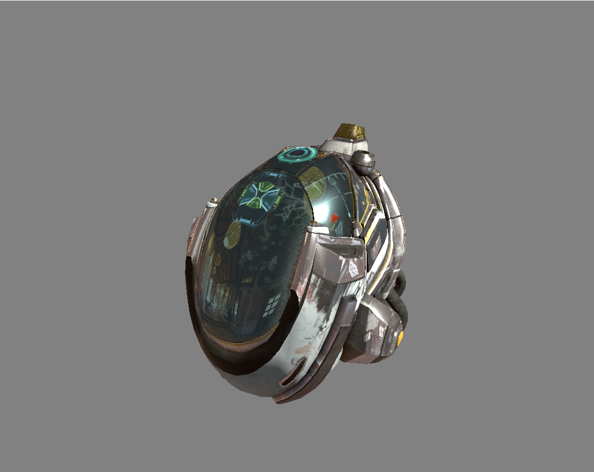
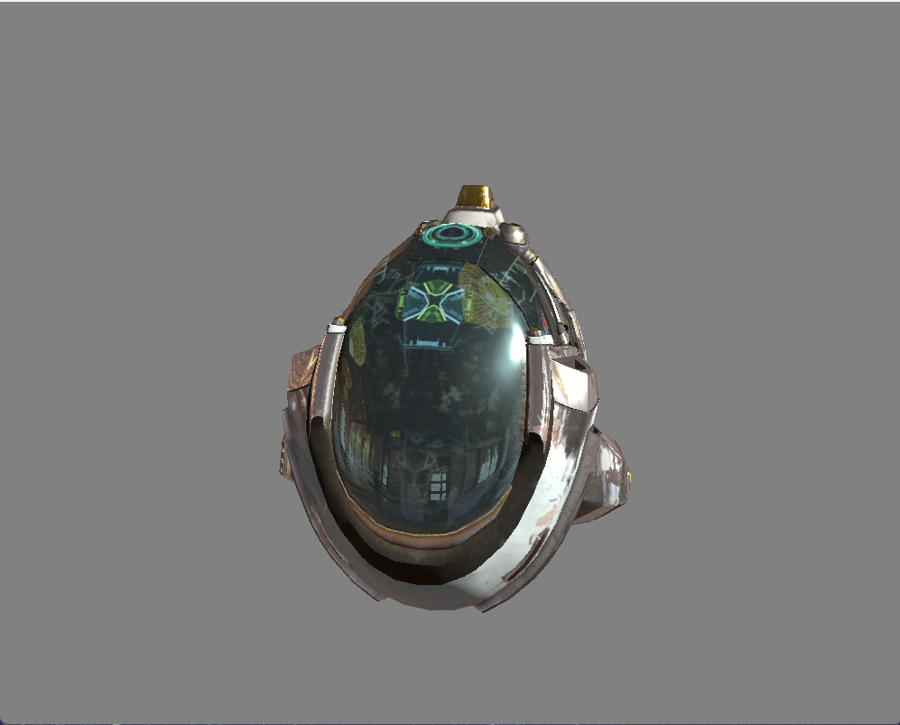

# Vulkan101

A modern Vulkan rendering application featuring PBR (Physically Based Rendering) shading with cubemap reflections.

## Features

- **PBR Material System**: Albedo, normal, metallic-roughness, ambient occlusion, and emissive textures
- **Cubemap Support**: Environment mapping and reflections
- **Model Loading**: OBJ format support with automatic tangent calculation
- **Modern Vulkan Architecture**: Clean, well-structured code with RAII wrappers




## Quick Start (Windows)

### Prerequisites
- Visual Studio 2019 or 2022
- Vulkan SDK
- CMake 3.20+

### Build & Run

```cmd
# Simple build
build.bat

# Run the application
run.bat

# Clean build
build.bat --clean --release
```

### Manual Build

```cmd
cmake -B build -G "Visual Studio 17 2022" -A x64
cmake --build build --config Release
build\bin\Release\Vulkan101.exe
```

## Quick Start (Linux/macOS)

### Build & Run

```bash
# Make scripts executable (first time only)
chmod +x build.sh run.sh

# Build
./build.sh

# Run
./run.sh
```

## Detailed Build Instructions

See [BUILD.md](BUILD.md) for comprehensive build instructions including:
- Dependency installation
- Platform-specific setup
- Troubleshooting guide
- Advanced build options

## Project Structure

```
Vulkan101/
├── source/              # C++ source and headers
│   ├── Application.*    # Main application class
│   ├── Device.*         # Vulkan device wrapper
│   ├── Texture.*        # Base texture class
│   ├── Cubemap.*        # Cubemap texture (inherits Texture)
│   └── ...              # Other Vulkan components
├── shaders/             # GLSL shader source
│   ├── shader.vert      # Vertex shader
│   └── shader.frag      # Fragment shader
├── models/              # 3D models (OBJ format)
├── textures/            # Texture assets
├── CMakeLists.txt       # CMake build configuration
├── build.bat / .sh      # Build scripts
└── BUILD.md             # Detailed build guide
```

## Recent Improvements

### Refactored Code Structure
- **Application.cpp**: Refactored into smaller, focused methods for better readability
  - `initVulkanCore()` - Instance, device, surface setup
  - `initRenderResources()` - Swapchain, pipeline, render pass
  - `initTextures()` - All texture loading
  - `initGeometry()` - Model and buffer creation
  - `initDescriptors()` - Descriptor sets configuration

- **Texture Inheritance**: Cubemap now properly inherits from Texture base class
  - Eliminates code duplication
  - Consistent interface across texture types
  - Easier to extend with new texture types

### Helper Methods
- `loadTexture()` - Simplified texture loading
- `createDescriptorImageInfo()` - Descriptor helper
- `computeTangents()` - Tangent space calculation

## Dependencies

- **Vulkan SDK** (1.3+): https://vulkan.lunarg.com/
- **GLFW** (3.3+): https://www.glfw.org/
- **GLM** (0.9.9+): https://github.com/g-truc/glm
- **stb_image**: https://github.com/nothings/stb
- **tinyobjloader**: https://github.com/tinyobjloader/tinyobjloader

## Requirements

- **C++17** compatible compiler
- **Vulkan 1.3** capable GPU
- **Windows 10+**, **Linux**, or **macOS**

## Build Scripts

### Windows (`build.bat`)
```cmd
build.bat [--debug|--release] [--clean] [--vs2019|--vs2022]
```

### Linux/macOS (`build.sh`)
```bash
./build.sh [--debug|--release] [--clean] [--verbose] [-j N]
```

## Running the Application

After building:

### Windows
```cmd
run.bat                  # Run Release build
run.bat --debug          # Run Debug build
```

### Linux/macOS
```bash
./run.sh                 # Run Release build
./run.sh --debug         # Run Debug build
```

## CMake Options

```bash
# Specify library paths manually
cmake -B build \
    -DGLFW_INCLUDE_DIR=/path/to/glfw/include \
    -DGLFW_LIBRARY=/path/to/glfw/lib/glfw3.lib \
    -DGLM_INCLUDE_DIR=/path/to/glm \
    -DSTB_INCLUDE_DIR=/path/to/stb \
    -DTINYOBJLOADER_INCLUDE_DIR=/path/to/tinyobjloader

# Build types
cmake -B build -DCMAKE_BUILD_TYPE=Debug      # Debug
cmake -B build -DCMAKE_BUILD_TYPE=Release    # Release
```

## Troubleshooting

### Common Issues

**Vulkan SDK not found**
```bash
# Windows
set VULKAN_SDK=C:\VulkanSDK\1.3.xxx.x

# Linux/macOS
export VULKAN_SDK=/path/to/vulkan-sdk
source $VULKAN_SDK/setup-env.sh
```

**Missing Dependencies**
- Check [BUILD.md](BUILD.md) for detailed installation instructions
- Ensure all paths are correctly set in CMake

**Shader Compilation Failed**
- Pre-compiled shaders are included in `shaders/` directory
- Ensure `glslc` is in PATH (part of Vulkan SDK)

## Development

### Code Style
- C++17 standard
- RAII wrappers for Vulkan resources
- Clear separation of concerns
- Comprehensive comments and documentation

### Adding New Textures
```cpp
// In Application::initTextures()
m_newTexture = loadTexture("path/to/texture.jpg");
```

### Adding New Descriptor Bindings
```cpp
// In Application::initDescriptors()
VkDescriptorImageInfo imageInfo = createDescriptorImageInfo(m_texture);
descriptorWrites[N] = createDescriptorWrite(
    m_descriptorSets[i],
    N,
    VK_DESCRIPTOR_TYPE_COMBINED_IMAGE_SAMPLER,
    &imageInfo
);
```

## License

[Add your license information here]

## Resources

- [Vulkan Tutorial](https://vulkan-tutorial.com/)
- [Vulkan Guide](https://vkguide.dev/)
- [Vulkan Specification](https://www.khronos.org/registry/vulkan/)
- [GLFW Documentation](https://www.glfw.org/docs/latest/)

## Contributing

Contributions are welcome! Please ensure:
- Code follows existing style
- All builds pass (Debug and Release)
- No validation layer errors
- Clear commit messages

## Acknowledgments

- **Models & Textures**: [Specify source/license]
- **Libraries**: Vulkan, GLFW, GLM, stb, tinyobjloader
- **Inspiration**: Vulkan Tutorial by Alexander Overvoorde
