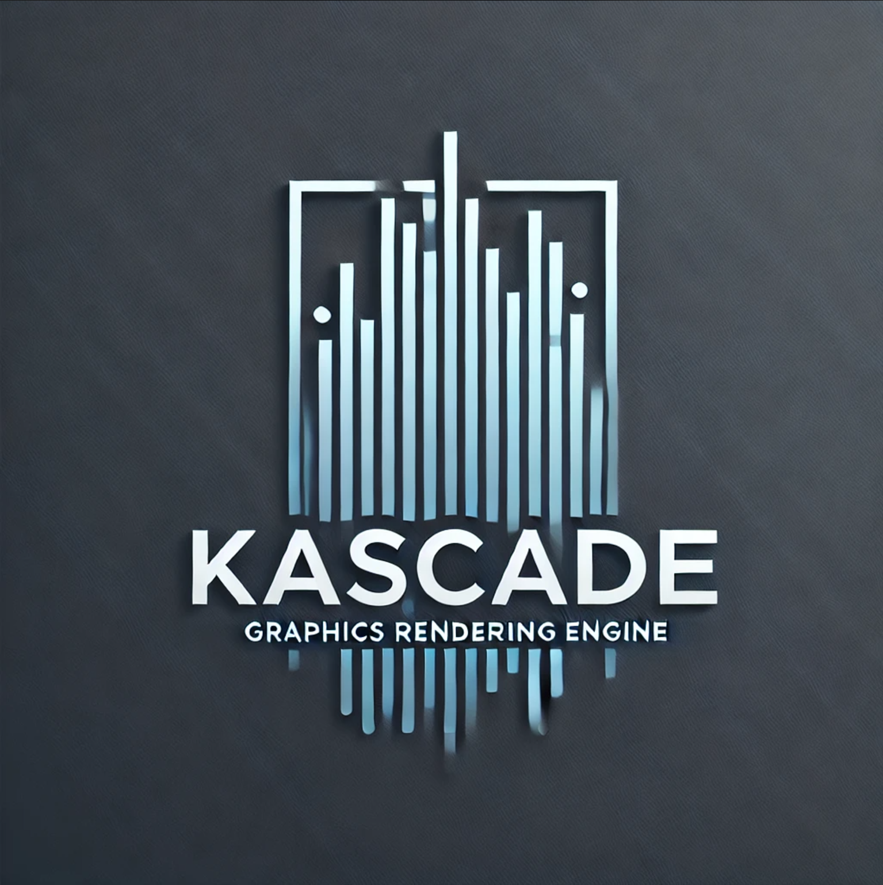

# Kascade - A High-Performance Vulkan Rendering Engine

Kascade is a custom-built, high-performance rendering engine focused on real-time graphics, leveraging the power of Vulkan for modern graphics applications. Designed with flexibility and modularity in mind, Kascade supports essential features such as deferred rendering, physically-based rendering (PBR), and an extensible rendering pipeline. It is ideal for developers looking to explore Vulkan and build sophisticated graphics applications with a focus on performance and scalability.



## Key Features

- **Vulkan-based rendering**: Harnesses Vulkan's capabilities for efficient, low-level control over GPU resources and rendering pipelines.
- **Deferred Rendering**: Implements G-buffer and lighting passes to support complex lighting models.
- **PBR (Physically-Based Rendering)**: Utilizes the metallic-roughness workflow for realistic material rendering.
- **Modular Design**: Built with a focus on clean code architecture, Kascade is highly modular and easy to extend.
- **Cross-platform support**: Primarily developed for Windows, with potential for other platforms in the future.

## Getting Started

To get started with Kascade, follow these steps:

### Prerequisites

- **Vulkan SDK**: Download and install the Vulkan SDK from [LunarG's website](https://vulkan.lunarg.com/sdk/home).
- **CMake**: Use CMake to manage the build system.
- **GLFW**: For window management, Kascade uses the GLFW library (included in the `third_party` folder).

### Building the Project

1. Clone this repository to your local machine.
2. Create a build directory:

    ```bash
    mkdir build
    cd build
    ```

3. Run CMake to configure the project:

    ```bash
    cmake ..
    ```

4. Build the project:

    ```bash
    cmake --build .
    ```

5. Run the executable (`Kascade.exe`) located in the `build` directory.

### Running the Engine

Once the project is built, simply run the executable to launch the engine. It will create a window and initialize Vulkan.

## Contributing

Kascade is an open-source project, and contributions are welcome! If you would like to contribute, feel free to open an issue or submit a pull request.

### Code of Conduct

By participating in this project, you agree to abide by the [Code of Conduct](CODE_OF_CONDUCT.md).

## License

This project is licensed under the MIT License - see the [LICENSE](LICENSE) file for details.

## Acknowledgements

- **Vulkan SDK**: A powerful graphics API that enables high-performance rendering.
- **GLFW**: A library for creating windows, contexts, and managing input.

## Contact

For more information, please feel free to reach out via issues or discussions on the GitHub repository.
